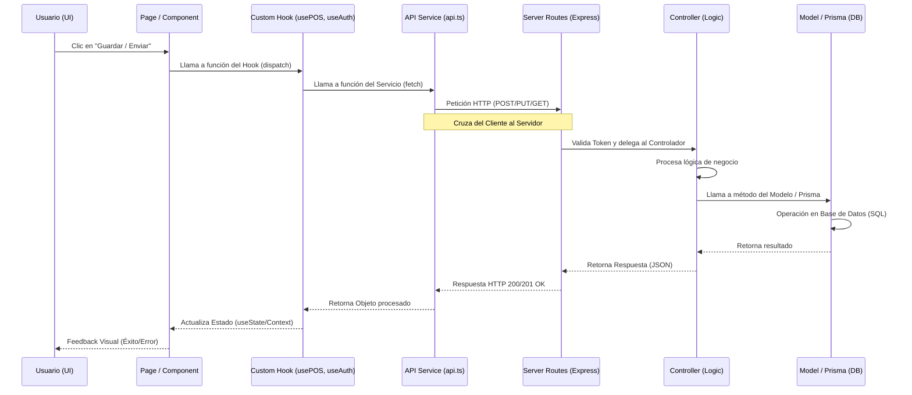

# ⚙️ Flujo Técnico de Datos (Full-Stack)

Este documento explica el ciclo de vida de una petición, desde que el usuario interactúa en una página hasta que los datos se persisten en la base de datos.

---

## 🛰️ Ciclo de Vida de una Petición

A continuación se muestra el camino que sigue una acción (ej: Registrar una venta en el POS o un nuevo usuario).

---

## 📂 Responsabilidades por Capa

### 1. 🎨 Frontend (Client)
- **Pages/Components**: Capturan la entrada del usuario y disparan acciones.
- **Hooks (`/hooks`)**: Centralizan la lógica de estado y efectos (ej: cargar datos al montar).
- **Services (`/services/api.ts`)**: Único punto de contacto con el servidor. Usa `fetch` para peticiones REST.

### 2. 🔌 Backend (Server)
- **Routes (`/routes`)**: Definen los "endpoints" y aplican *Middlewares* (seguridad, validación).
- **Controllers (`/controllers`)**: El "cerebro". Valida datos, maneja errores y decide qué hacer.
- **Models/Prisma (`/models` o `prisma.schema`)**: Se comunica con la base de datos mediante clases POO o el ORM Prisma.

---

## 🔄 Ejemplo: Registro de Venta (POS)

1. **Interfaz**: El vendedor añade productos y pulsa "Finalizar Venta".
2. **Hook**: `usePOS.ts` organiza el objeto de la venta (productos, total, cliente).
3. **Servicio**: `api.ts` envía un `POST /api/sales` con el JSON de la venta.
4. **Ruta**: El servidor recibe la petición y verifica que el usuario es un `staff` o `admin`.
5. **Controlador**: El controlador de ventas descuenta el stock de cada producto y crea el registro de la venta.
6. **Respuesta**: El servidor devuelve la venta creada; el frontend limpia el carrito y muestra un mensaje de éxito.

---
*Este diseño asegura que el sistema sea escalable, fácil de testear y desacoplado.*
